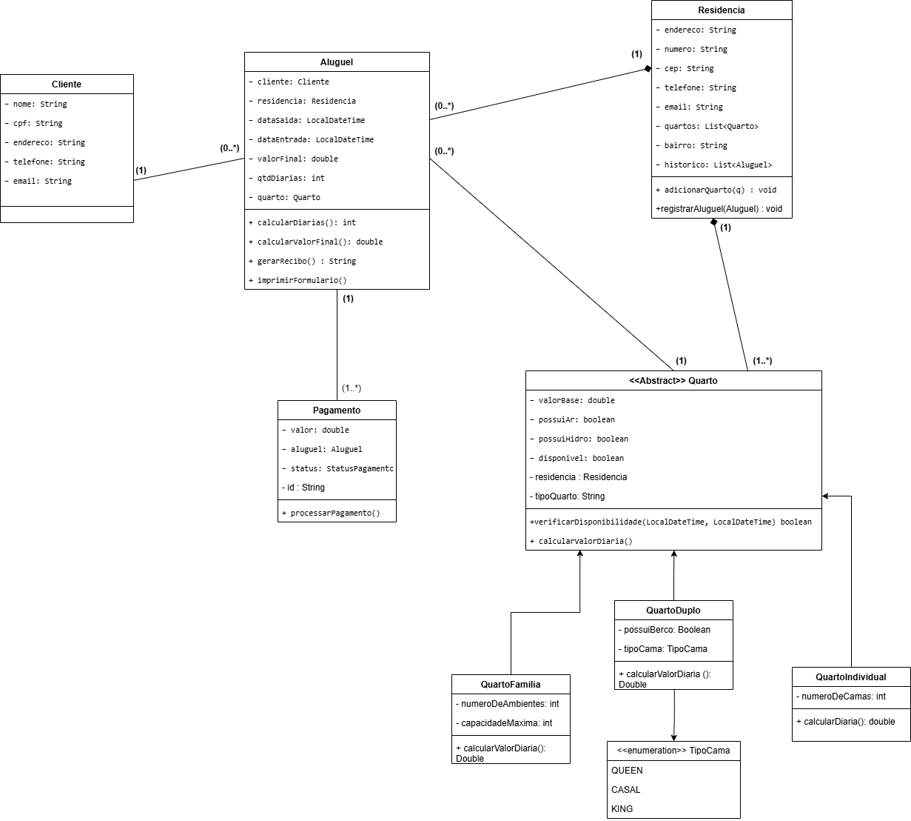

# SisHosp Maraú

O Ministério do Turismo tem incentivado os brasileiros a conhecer melhor o Brasil, exibindo imagens de cenários de exuberante beleza. Um desses cenários é Maraú – BA, que é uma região peninsular, reduto de Mata Atlântica preservado. Maraú possui piscinas naturais, recifes de coral, mares interiores, manguezais, cachoeiras, trilhas ecológicas e diversas praias.

Com o aumento da demanda por hospedagem, moradores locais passaram a oferecer quartos em suas residências. Para organizar esse processo de forma eficiente e escalável, será desenvolvido um Sistema de Informação Modular com API REST, utilizando conceitos avançados de Programação Orientada a Objetos (POO).

### Objetivo
Desenvolver, ao longo do semestre, um sistema completo de gerenciamento de hospedagens, contemplando:
* Modelagem orientada a objetos
* Arquitetura em camadas (Controller, Service, Repository, Model)
* API REST com Spring Boot
* Persistência em banco de dados (MySQL)
* Testes automatizados
* Aplicação de padrões de projeto

### Escopo do Sistema
O sistema deve permitir:
* Gerenciamento de residências e quartos
* Cadastro e autenticação de clientes
* Realização de reservas e aluguéis
* Cálculo automático de diárias
* Emissão de recibos
* Controle de disponibilidade
* Histórico de hospedagens

### Regras de Negócio
1.  **Cálculo de Diárias:** As diárias sempre iniciam às 12h. O cálculo deve considerar:
    * Entrada após 12h → conta como diária completa.
    * Saída após 12h → adiciona nova diária.
2.  **Valor da Diária:** Não é informado diretamente. Deve ser calculado com base em:
    * Valor base (definido pelo proprietário).
    * Tipo do quarto.
    * Itens adicionais (ar-condicionado, hidromassagem).
3.  **Disponibilidade:** Um quarto não pode ser alugado se já estiver ocupado no período.
4.  **Reservas:** Deve ser possível realizar reservas futuras.
5.  **Pagamento:** Um aluguel deve gerar um pagamento associado.

### Características e Requisitos do Sistema
1.  **Residência:** Contém pelo menos: endereço, número, bairro, CEP, telefone, e-mail e uma lista de quartos para alugar.
2.  **Quarto:** Pode ser individual ou para casal. Possui: valor da diária, indicador de ar-condicionado e indicador de banheira de hidromassagem.
3.  **Valor Base:** A diária base de cada quarto (solteiro ou casal) é definida pelo proprietário.
4.  **Registro de Aluguel:** É necessário armazenar: Residência, quarto, cliente, data de entrada e saída, quantidade de diárias e valor final.
5.  **Histórico:** Guardar histórico de aluguéis por residência.
6.  **Composição de Valor:** O valor final é definido pelo valor base + adicionais (ar-condicionado e/ou hidromassagem).
7.  **Cliente:** Contém pelo menos: nome, CPF, endereço, telefone e e-mail de contato.
8.  **Formulário de Aluguel:** Deve ser impresso na tela com o seguinte formato:
    * Data e horário de entrada:
    * Data e horário de saída:
    * Número de diárias:
    * Total a pagar:

## Integrantes

* Anny Victorya Azevedo Oliveira
* Gustavo Rodrigues Barbara Moreira 

## Professor

Glender Brás de Medeiros

## Diagrama de Classes
 

## Cartão CRC
Os cartões CRC (Classe – Responsabilidade – Colaboração) são uma técnica utilizada no processo de modelagem orientada a objetos. Eles ajudam a representar de forma simples e visual as principais responsabilidades de uma classe e como ela se relaciona com outras classes dentro de um sistema.

### Caso de Uso: Gerenciar Residências

| **Classe: Residencia** | |
| :--- | :--- |
| **Responsabilidades** | **Colaborações** |
| • Conhecer seu endereço | • Quarto |
| • Conhecer seu número | |
| • Conhecer seu bairro | |
| • Conhecer seu CEP | |
| • Conhecer seu telefone de contato | |
| • Conhecer seu e-mail de contato | |
| • Conhecer a lista de quartos disponíveis para aluguel | |
| • Conhecer o histórico de aluguéis realizados | |
| •	Adicionar e remover quartos da lista | |

---

### Caso de Uso: Gerenciar Quartos

| **Classe: Quarto (abstrata)** | |
| :--- | :--- |
| **Responsabilidades** | **Colaborações** |
| • Conhecer seu valor base de diária | • Residencia |
| • Conhecer se possui ar-condicionado | • QuartoIndividual|
| • Conhecer se possui banheira de hidromassagem | • QuartoDuplo  |
| • Conhecer a residência à qual pertence | • QuartoFamilia |
| • Calcular o valor dos adicionais comuns (AR + hidro) | |

---

| **Classe: QuartoIndividual** | |
| :--- | :--- |
| **Responsabilidades** | **Colaborações** |
| • Conhecer o número de camas | • Quarto |
| • Calcular o valor da diária | |
| • Retornar capacidade: igual ao número de camas | |
| • Retornar tipo: Individual| |

---

| **Classe: QuartoDuplo** | |
| :--- | :--- |
| **Responsabilidades** | **Colaborações** |
| • Conhecer o tipo da cama (casal, queen ou king) | • Quarto |
| • Conhecer se possui berço disponível | |
| • Calcular o valor da diária | |
| • Adicionar R$30 se solicitar berço | |
| • Retornar capacidade: 2 (+1 se possuir berço) | |
| • Retornar tipo: Duplo | |

---

| **Classe: QuartoFamilia** | |
| :--- | :--- |
| **Responsabilidades** | **Colaborações** |
| • Conhecer a capacidade máxima de hóspedes | • Quarto |
| • Conhecer o número de ambientes | |
| • Calcular o valor da diária | |
| • Aplicar desconto de 8% para ≥3 hóspedes | |
| • Aplicar desconto de 15% para ≥5 hospedes | |
| • Retornar tipo: Família  | |

### Caso de Uso: Cadastrar e Autenticar Clientes

| **Classe: Cliente** | |
| :--- | :--- |
| **Responsabilidades** | **Colaborações** |
| • Conhecer seu nome completo | • Aluguel |
| • Conhecer seu CPF | |
| • Conhecer seu endereço | |
| • Conhecer seu telefone de contato | |
| • Conhecer seu e-mail de contato | |

---

### Caso de Uso: Realizar Aluguel

| **Classe: Aluguel** | |
| :--- | :--- |
| **Responsabilidades** | **Colaborações** |
| • Conhecer a residência associada | • Residencia |
| • Conhecer o quarto alugado | • Quarto |
| • Conhecer o cliente responsável | • Cliente |
| • Conhecer a data e horário de entrada | • Pagamento |
| • Conhecer a data e horário de saída | |
| • Conhecer a quantidade de diárias calculadas | |
| • Conhecer o valor total do aluguel | |
| • Conhecer o status (Ativo/Cancelado) | |
| • Calcular o valor final (diária do quarto × quantidade de diárias) | |
| • Calcular quantidade de diárias (regra das 12h)  | |
| • Gerar o formulário de aluguel (texto formatado) | |

---

### Caso de Uso: Registrar Pagamento

| **Classe: Pagamento** | |
| :--- | :--- |
| **Responsabilidades** | **Colaborações** |
| • Conhecer o aluguel ao qual está vinculado | • Aluguel |
| • Conhecer o valor total a pagar | • StatusPagamento(enum) |
| • Conhecer seu status (pendente, efetuado, cancelado) |• MetodoPagamento(enum) |
| • Conhecer data/hora em que foi processado | |
| • Conhecer o metodo de pagamento| |
| • Processar pagamento (mudar status para Efetuado) | |
| • Cancelar o pagamento (mudar status para Cancelado) | |

### Caso de Uso: Orquestrar Regras de Negócio

| **Classe: AluguelService (Service)** | |
| :--- | :--- |
| **Responsabilidades** | **Colaborações** |
| • Receber pedido de criação de aluguel | • Aluguel |
| • Buscar Cliente por ID (via ClienteRepository) | • Quarto |
| • Buscar Quarto por ID (via QuartoRepository) |• Cliente |
| • Validar datas: entrada deve ser antes de saída |• AluguelRepository |
| • Validar berço: solicitar só se quarto possuir berço| • QuartoRepository|
| • Verificar disponibilidade: checar conflitos no período|• ClienteRepository |
| • Calcular valor total = diária × número de diárias |• PagamentoRepository |
| • Persistir Aluguel e gerar Pagamento associado|• GlobalExceptionHandler |
| • Cancelar aluguel (status → CANCELADO)| |
| • Listar aluguéis por residência ou por cliente| |
---

[Clique aqui para abrir os Cartões CRC](crc.docx)

